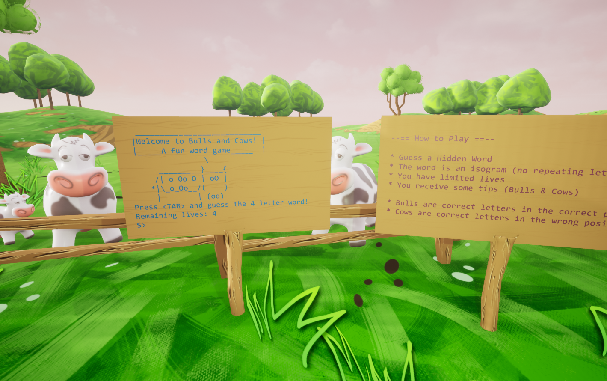
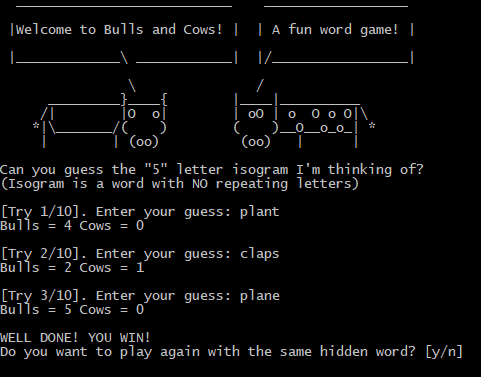

# Bulls & Cows 2.0

🐮 A console text game...in C++ 🐂

Can you find the isogram? (a word with no repeating letters)

2019 - A more visual approach, still emulating a terminal.

## First Version

For posterity I keep the first version here **_originalProject/BullCowGame/**

The purpose of this game is to get acquainted with the C++ language, before diving into Unreal Engine!

## About the course

Based on the Section 2 of the [Unreal Engine Developer Course](https://www.udemy.com/unrealcourse/learn/v4/overview) by Ben Tristem & Sam Pattuzzi

This is course was remastered in 2019 and was moved to a more "visual approach", but the essence is the same.
